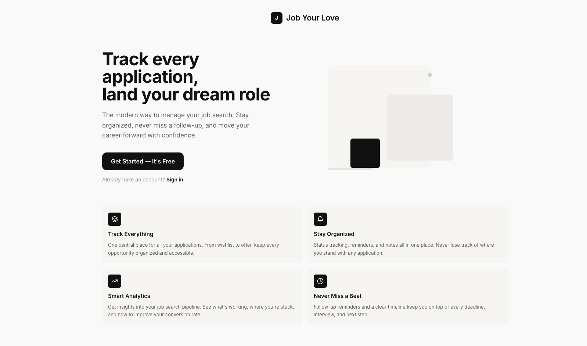
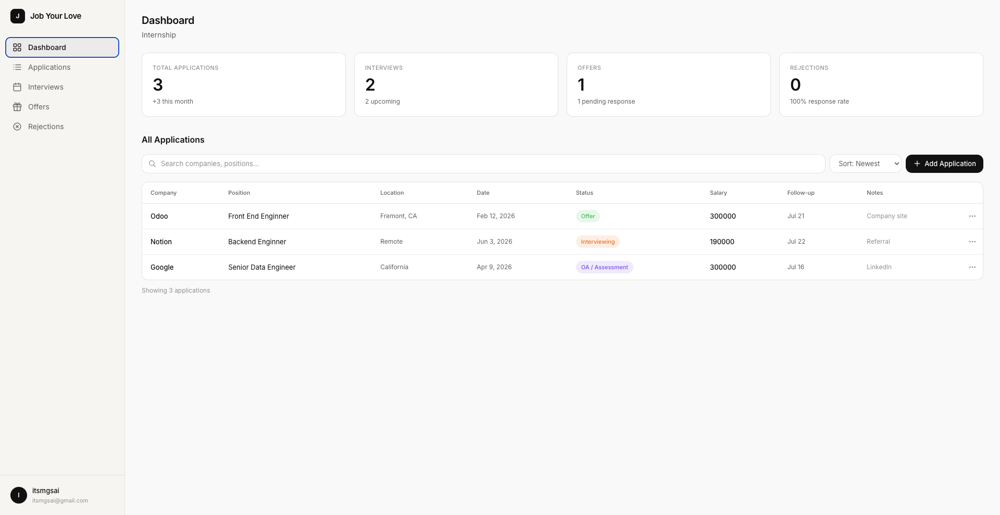
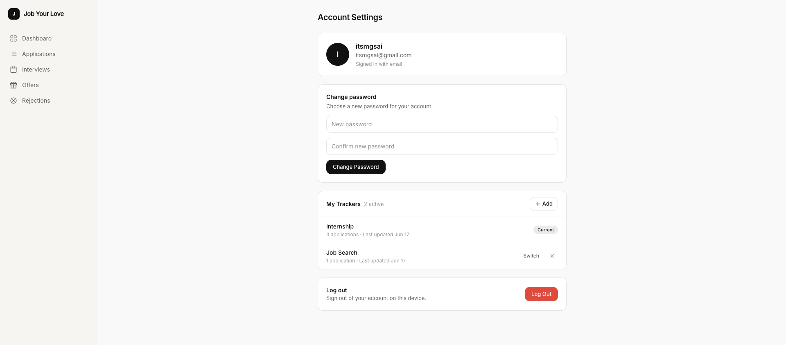

# Job Your Love — Job Application Tracker

A private, spreadsheet-style job application tracker where every user only ever sees their own data.

**Live app:** [job-your-love.megiapps.workers.dev](https://job-your-love.megiapps.workers.dev/)

**Project repo / download:** [github.com/saiwaiyanphyo/job-your-love](https://github.com/saiwaiyanphyo/job-your-love)

Every user gets their own tracker: an Excel-like grid where each row is a job application, with custom columns, inline editing, and a dashboard to see how the search is going at a glance.

Built with **Next.js (App Router) + TypeScript** and **Tailwind CSS**, deployed on **Cloudflare Workers**. Sign-in uses **Supabase Auth**; all app data lives in **Cloudflare D1**.

---

## Screenshots


*Landing page — value prop and feature highlights*


*Dashboard — stat cards and all-applications table*


*Account settings — password change and tracker switching*

---

## Features

### Authentication
- Email/password sign-up with email confirmation
- Email/password login
- Google login (OAuth)
- Password reset via email
- Logout
- Protected `/dashboard/**` routes, enforced in middleware
- Per-user data isolation — every D1 query is scoped to the signed-in user's id

### Application tracker
- Dashboard with live stat cards (Total, Interviews, Offers, Rejections + response rate)
- Applications table with search, sort, and inline colored status changes
- Status-filtered views: Interviews, Offers, Rejections
- Add / edit / delete applications via a dedicated form
- Import an application by pasting a confirmation email (AI extraction)
- Detail panel per application: meta, job description, timeline, contact, follow-ups
- Mini CV builder with PDF export
- Account settings: change password, sign-in provider, logout
- All data persisted per user in Cloudflare D1 (`job_entries.data` as JSON)

### Onboarding & pipeline
- Onboarding templates — Job Search, Internship, Custom Tracker — offered on first sign-in
- Status pipeline with colored badges: Wishlist · Applied · OA/Assessment · Interviewing · Final Round · Offer · Accepted · Rejected

### Design
- Inter font with a calm monochrome palette and status accent colors, built from a Pencil design
- Responsive: sidebar on desktop, top bar + bottom tab bar and card lists on mobile

---

## Data & deployment

| Concern | Where |
| --- | --- |
| Sign-in, sessions, password reset | Supabase Auth (`NEXT_PUBLIC_SUPABASE_URL`, `NEXT_PUBLIC_SUPABASE_ANON_KEY`) |
| Trackers, applications, resumes | Cloudflare D1 database `job-your-love`, bound as `DB` in `wrangler.jsonc` |
| Schema | SQL files in [`migrations/`](migrations) |

D1 has no row-level security, so data access in `src/lib/data.ts`, `src/lib/resume/data.ts`, and the server actions always filters by `user_id`. Keep that rule for any new query.

**Apply schema changes** — add a numbered file to `migrations/`, then:

```bash
npx wrangler d1 migrations apply job-your-love --remote
```

**Deploy** — the Worker reads the Supabase and AI keys from Worker secrets (`npx wrangler secret put <NAME>`), so no local `.env` is needed to deploy:

```bash
npm run deploy
```

After changing bindings in `wrangler.jsonc`, regenerate types with `npm run cf-typegen`.

## License

MIT — see [LICENSE](LICENSE).
